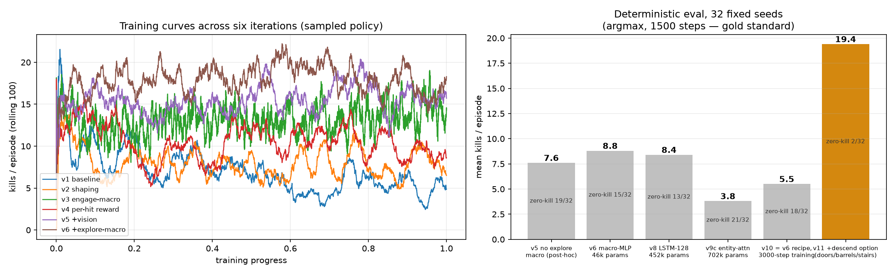

# AlphaDiablo / DiabloGym

[](https://github.com/Diabolically-Handsome/AlphaDiablo/actions/workflows/ci.yml)

**A fast, deterministic Diablo I reinforcement-learning environment** built on
[DevilutionX](https://github.com/diasurgical/devilutionX), plus the training
pipeline that took a PPO agent from *hiding in a corner* to *opening doors,
smashing barrels, looting potions and fighting its way down through the
dungeon* — fourteen documented runs, one diagnosed failure mode eliminated
(or one hypothesis falsified) per run.

- 🚀 **~13,000× realtime**: full game logic, headless — 254k engine ticks/s raw,
  ~7,500 `env.step()`/s with full observations (M-series MacBook, measured)
- 🎲 **Deterministic**: `reset(seed)` owns the dungeon seeds *and* the global RNG
  stream; evaluations are bit-reproducible across processes (verified per-seed,
  see protocol notes in [train/evaluate.py](train/evaluate.py)); engine source
  pinned to an exact upstream commit by [bootstrap.sh](bootstrap.sh)
- 🧩 **Gymnasium API**: structured observations (entity features + 11×11 local
  map + potion/gear preconditions), macro-actions (engage / explore / descend /
  drink / pick-up-potion / pick-up-gear)
- 📊 **Zero-dependency live dashboard** for training runs
- 🩹 Ships **upstream fixes** for six DevilutionX headless-mode bugs — asset
  fallbacks, monster-missile anims (a bat swoop was the first crash), the
  unloaded SFX table (the Butcher's greeting was the second) — in `patches/`



*Left: training-time kills (sampled policy, rolling 100) across the six
iterations that built the champion. Right: the gold standard — deterministic
(argmax) evaluation on 32 fixed seeds. Full run-by-run post-mortems in
[docs/DESIGN.md](docs/DESIGN.md) (Chinese; lesson summaries below).*

## Results (32-seed deterministic gold standard)

| model | params | mean kills | median | max | zero-kill | reached L2 |
|---|---|---|---|---|---|---|
| v5 vision, no explore macro¹ | 45,771 | 7.6 | 0 | 45 | 19/32 | 0/32 |
| v6 macro-MLP | 45,836 | 8.8 | 3.5 | 36 | 15/32 | 0/32 |
| v8 LSTM-128 | 451,596 | 8.4 | 3.0 | 43 | 13/32 | 0/32 |
| v9c entity-attention | 701,980 | 3.8 | 0 | 38 | 21/32 | 0/32 |
| v10 = v6 recipe, 3000-step episodes | 45,836 | 5.5 | 0 | 49 | 18/32 | 0/32 |
| v11 = v6 + descend option | 45,901 | 19.4 | 14.5 | **70** | 2/32 | **27/32** |
| v12 = v11 + belt-potion action | 45,966 | 12.3 | 10.0 | 46 | 9/32 | 26/32 |
| **v13 = potion system made learnable (champion)** | 46,543 | **35.2** | 29.0 | 65 | 1/32 | 25/32 |
| v14 = v13 + auto-equip gear | 47,120 | 28.0 | 26.0 | 67 | 1/32 | 19/32 |
| v15 = v14 + AC-gain reward shaping | 47,120 | 31.3 | 30.5 | 66 | 2/32 | 19/32 |
| v16 = v15 + gear-key action masking | 47,120 | 34.5 | **33.5** | **80** | **0/32** | 18/32 |

¹ *Evaluated post-hoc on the current env (same observation; it never selects
the explore macro). Protocol: seeds 9000-9031, 1500 steps, argmax, idle
machine, pinned engine — [train/leaderboard.md](train/leaderboard.md).*

Honesty notes: each row is a **single training run** (v1-v10 unseeded; v11
onward uses `--seed`), and a 32-seed mean has an SEM of ≈2 kills — so the
v5/v6/v8 means are statistically indistinguishable and ordering claims rest
on the distribution shape (median, zero-kill), not the means. The v11 jump,
by contrast, moves every column at once and is far outside that noise band.
v13 is the first config with a same-config seed repeat (means 35.2 and
38.1 — the effect is robust), and the repeat taught us something the level
could not: deaths (12 vs 21/32) and drink discipline (93% vs 46%
real-share) vary wildly between runs of the same config. *How much* it
wins is reproducible; *how* it wins is not. v14's registered predictions
went **0/5** — gear-equip rate ≥16/32 landed at **0/32** (six presses of
the gear key in 48,000 evaluation steps); the post-mortem is lesson 13,
and v13 remains champion. v15 (bounded AC-gain shaping, lesson 13's
cheapest prescription) went **2/4**: mean kills ≥30 hit (31.3) and deaths
≤11 hit at an **all-time low of 9/32** — but both gear predictions were
obliterated again (0/32 equips, *one* gear-key press in 48,000 steps),
and real-drink share drew 60%, the style lottery's fourth hand
(93/46/37/60%). Lesson 14; v13 remains champion. v16 (gear-key action
masking) went **3/4** and resurrected the button by intervention: 258
gear-key presses and **16/32 episodes equipped** (from one press and
0/32 in v15), plus three all-time firsts (median 33.5, max 80,
zero-kill 0/32) — but deaths ≤13 missed at 14, descent slipped to
18/32, and outcomes never followed the armor (7 of 16 geared episodes
died and dropped it, 3 broke it in combat). The no-op attractor,
evicted from the masked key, resettled on the drink/pickup keys:
real-drink share crashed to 3.7% (fifth hand; the PPO→MaskablePPO swap
is a registered confound). Lesson 15; v13 still holds mean kills and
descent.
Leaderboard checkpoints are not distributed yet (a tagged release is
planned); rows come from the author's runs and are deterministically
re-evaluable given the checkpoint. Champion honesty numbers: v13's
pre-registered predictions went **2/4** — real-drink share >50% and mean
≥16 hit; deaths ≤10 **missed** (12/32), reached-L2 ≥26 **missed** (25/32).
Deaths did fall 17/32 → 12/32 while the kill rate nearly doubled, but one
seed (9001) migrated the v12 idle-spam attractor onto the new pickup key —
1,448 no-op presses (lesson 12). Observation changes (286→290 in v13, 290→294 in v14) end
direct re-evaluation of older checkpoints on the current env; each row
stands on the env version it was scored under (same policy as v1-v4/v7).

### Deep-water chapter (v17+, separate board)

The gear/survival economy moved to its natural habitat: 3000-step
episodes with a depth-progressive descent ladder (level N→N+1 pays 8×N),
scored on [train/leaderboard-deep.md](train/leaderboard-deep.md) — not
comparable to the table above. The opener (v17) transformed the species
with one reward knob: depth median L3, 11/32 episodes touch L4 (the old
chapter's deepest-ever), 28/32 leave L1 — but as a level-1 stair-rusher
that farms nothing, wears nothing, and dies in 22/32 episodes, 16 of
them with a dry belt. The ladder priced *touching* depth, not
*surviving* it, and the policy solved the prices as written (lesson 16).
v18 applied the lesson's single knob — death now costs 8×level — and
the pendulum swung hard back: kills 9.6 → 32.1, the armor audition
finally convened (15/32 episodes equip, after farming resumed and
drops existed again), dry deaths fell from 16/22 to 4/19… and depth
retreated (median L2, one L4). Its dead now die fully stocked: at
character level 1-2, the L2-L3 monsters burst faster than a belt can
heal. The bottleneck has moved twice in two generations — sampling →
resources → character power — and the farm-then-dive spiral exists in
embryo (the five episodes that descended at level ≥2 are the best on
the board).

Four findings we did not expect:

1. **At this scale, task design beats architecture** (directional evidence,
   one run per architecture). With a 3M-step budget, a 46k-parameter MLP
   equipped with two hand-built macro-actions matches a 10×-larger LSTM, and
   a 15×-larger entity-attention model never trained stably — even with
   double the budget (6M steps) it ended at 3.8. The single-episode max is
   too noisy to rank architectures (the memoryless v5 hit 45; the LSTM 43).
   The wins came from reward attribution, action granularity and an
   exploration option — not from bigger brains.
2. **The remaining failures are dead zeros, not slow episodes.** Doubling the
   evaluation horizon to 3,000 steps changes *nothing*: per-seed kill counts
   are bit-identical at both horizons for both v6 and v10, all 32 seeds. When
   the spawn pocket has no reachable prey, the agent never recovers — a
   planning/exploration failure, not a time budget one.
3. **Capability lives in the action space, not the parameter count.** The
   dead zeros turned out to be a *sensor* problem: closed doors are
   indistinguishable from walls in the walkability channel, so part of every
   level is invisible-by-construction. A static "sealed spawn" analysis
   predicts zero-kill episodes for the MLP, the LSTM and the attention model
   with zero false positives (15/15 cells) — information destroyed at the
   sensor is unrecoverable by any downstream architecture. v11 added **one
   action** (a descend option that plans through doors/barrels with a
   full-map BFS and operates them en route), left observation, rewards and
   architecture untouched, and doubled the gold standard — where a 15×
   parameter increase had previously *lost* points. Emergent bonus: on the
   deepest sealed seed the policy uses the descend macro as a *door-opening
   key* and farms the unsealed rooms without ever taking the stairs.
4. **One observation bit made the potion economy learnable — and nearly
   doubled the champion.** v12 and v13 share the same drink button. v12
   could not see the belt and spent 99.5% of its presses on an empty one;
   the seed-13 run of v13 spends 93.4% of its presses on a stocked one (25
   of 57 argmax drinks below half HP, the deepest at 1% HP), and the mean
   jumped 19.4 → 35.2. The seed-14 repeat keeps the kill level (38.1) but
   only 45.7% discipline (pooled: 65%) — the *capability* is unlocked by
   observability (lessons 5, 11, 12); how thoroughly a given run exploits
   it is seed lottery.

### Sixteen lessons from seventeen runs (short version)

1. Don't tax the intermediate costs of the behaviour you want, and don't leave
   zero-cost sanctuaries in the reward landscape (v1's wall-hugger).
2. Shaping must be attributed to the agent's own actions — monsters walking
   toward you is not progress (v2's fishing exploit).
3. When atomic actions are finer-grained than the task's causal structure,
   package them as temporally-extended options (v3's engage macro).
4. Densify rewards on conserved task progress (damage fractions), never on
   countable events (swing counts) — anything countable gets farmed (v4).
5. Rewards can only cash in information that exists in the observation; when
   failures cluster spatially, fix perception first (v5's 11×11 map).
6. Don't force a reactive policy to learn planning — wrap planning as an
   option and let the policy choose (v6's explore macro: the median episode
   went from 0 kills to 3.5 and zero-kill episodes from 19/32 to 15/32; the
   mean gap, +1.2, is within eval noise).
7. Macro engineering has degenerate attractors: each patch bred a new exploit;
   after three patch rounds (v7-v7d) we froze the interface instead.
8. Eight evaluation seeds lied to us in *both* directions (champion inflated
   77%, v5 deflated 15%); 32 fixed seeds, argmax, frozen protocol — and treat
   machine load as part of the protocol.
9. Architecture upgrades pay off only when the bottleneck is the brain: the
   LSTM matched but didn't beat the macro-MLP; attention never trained
   stably; doubling episode length changed nothing. The bottleneck is the
   spawn-pocket deadlock — task structure again.
10. Perception bounds what can be known, the action set bounds what can be
    done, architecture only tunes the efficiency in between (v11: one new
    option, +120% mean kills; v9c: 15× parameters, −57%). Audit those three
    layers in that order — the cheapest miracles live in the action space.
11. A new action is also a new hiding place. v12's drink action did its
    designed job on a few seeds (one argmax clutch heal from 8.6% HP) and
    deaths fell 17/32 → 10/32 — but mean kills regressed 19.4 → 12.3, and
    4,715 of 4,740 presses hit an empty belt. The belt count was
    deliberately kept out of the observation (protocol comparability), so
    the policy could never learn when *not* to press: lesson 5 applies to
    action preconditions too. Door-blindness, then bottle-blindness —
    self-inflicted this time. v11 keeps the crown.
12. Discipline is a function of observability, and hiding places are
    conserved. Giving the policy eyes on the belt (v13) turned 99.5% waste
    into 93.4% discipline and doubled the champion — but the idle-spam
    attractor from lesson 11 did not die, it migrated: one seed presses the
    new pickup key 1,448 times as its no-op corner, and the seed-14 repeat
    grew that to three seeds (one spends its *entire* 1,500-step episode on
    the key). Remove a hiding place and risk-averse probability mass flows
    to the next zero-risk action; budget for attractor migration whenever
    you add one — and only trust behaviour-composition claims that survive
    a seed repeat.
13. The reward stream is the last observer. v14 made gear preconditions
    fully observable (AC + nearest wearable in obs, auto-equip wired,
    probes green) and the policy still pressed the gear key 6 times in
    48,000 evaluation steps, equipping nothing: armor's consequence — a
    few percent less damage spread over hundreds of steps — is invisible
    to a 3M-step credit-assignment horizon. Perception bounds what can be
    known (5), the action set what can be done (10), the reward horizon
    what can be *learned*. A capability chain is only as strong as its
    least observable link: precondition → policy, consequence → learning
    signal.
14. Shaping amplifies; it does not summon. v15 paid a bounded one-shot
    bonus (+0.5 per AC point) the moment armor went on — lesson 13's
    cheapest prescription — and the policy pressed the gear key *once*
    in 48,000 evaluation steps (v14: six times). A shaping term only
    bends the value function along trajectories exploration actually
    completes; when the event chain (gear spawns → enters the obs →
    macro walks → auto-equips) is a product of small probabilities, the
    bonus is sampled too thinly to outweigh the key's ever-present cost,
    and the button dies anyway. Bootstrap the *event*, not the reward:
    demonstrations, forced-equip resets, or a gear-rich environment
    first — then shape. (The run itself was healthy: deaths hit an
    all-time low of 9/32 and kills held at 31.3 — a v13-class fighter
    that simply never touched its newest toy.)
15. Masking moves probability, not value. v16 masked the gear key to
    exist only when gear is in view, and the button resurrected
    overnight: one press per 48k steps → 258, equips 0/32 → 16/32 —
    lesson 14's mechanism confirmed by intervention. But outcomes did
    not follow: deaths and descent slipped, cheap L1 gear drops on
    death or breaks in combat, and wild macro completion stayed at the
    forced-press probe's ~6%. A mask can put a button back on the
    menu; it cannot make the goods worth buying — that is the task
    economics' job, and a 1500-step L1 episode cannot amortize armor.
    And the no-op attractor obeys conservation (lesson 12, third
    strike, cleanest yet): evicted from the masked key, it resettled
    on the unmasked drink/pickup keys. Structural hygiene relocates
    spam; only value can retire it.
16. You buy the behavior you price, not the behavior you mean. v17's
    escalating descent ladder (8/16/24 per level, death at −2) priced
    "touching depth" above everything, and the policy obliged: median
    first descent at step 138, every descent at character level 1,
    kills 34.5 → 9.6, deaths 22/32 — and the armor audition never
    convened (zero gear-key presses: no farming → no drops → nothing
    to wear). The knob steers at full power; it steered to the letter
    of the prices, not their intent ("survive at depth"). Rebalancing
    the auction — a death cost scaled to the ladder — is v18's single
    knob. Sixteen generations in, the constant: the agent solves your
    reward, never your intention; task design is where the
    intelligence lives.

## Quickstart (macOS, Apple Silicon)

```bash
# 0. Requirements: Homebrew, Xcode CLT, Python ≥3.11
python3 -m venv .venv && .venv/bin/pip install -e ".[train,build]"

# 1. Game data (pick one):
#    - Free shareware (dungeon levels 1-2, no quest monsters):
mkdir -p "$HOME/Library/Application Support/diasurgical/devilution"
curl -L -o "$HOME/Library/Application Support/diasurgical/devilution/spawn.mpq" \
  https://github.com/diasurgical/devilutionx-assets/releases/download/v5/spawn.mpq
#    - Full game: buy Diablo on GOG, extract DIABDAT.MPQ with `brew install innoextract`,
#      drop it in the same folder (see docs/DESIGN.md notes).

# 2. Engine + bridge (clones DevilutionX at the pinned commit, applies patches, builds)
./bootstrap.sh && ./build.sh

# 3. Verify: random agent + determinism + descend/seed-differentiation
.venv/bin/python tests/smoke_random_agent.py
.venv/bin/python tests/descend_seed_test.py

# 4. Train + watch
.venv/bin/python train/train_ppo.py --total-steps 3000000 --num-envs 4
.venv/bin/python train/dashboard.py        # → http://127.0.0.1:8787

# 5. Evaluate against the leaderboard protocol (idle machine!)
.venv/bin/python train/evaluate.py train/runs/<run>/model_final
```

## How it works

| Layer | Where | What |
|---|---|---|
| C++ bridge | `src/diablogym.cpp` | Embeds the whole engine as a shared library (`HeadlessMode`), drives the game loop tick-by-tick from Python, injects actions at the **network command layer** (same path as multiplayer — a trained agent can later join a TCP co-op game as a headless client) |
| Env | `python/diablogym/env.py` | Gymnasium env: 294-dim obs (player/monster entities + stairs direction + 11×11 walkability & monster-occupancy map + belt/floor-potion fields + AC/nearest-gear fields), `Discrete(15)` with engage/explore/descend/drink/pickup-heal/pickup-gear macro-actions, per-hit damage rewards |
| Training | `train/train_ppo.py` | SB3 PPO, subprocess vec-envs, per-episode JSONL metrics |
| Evaluation | `train/evaluate.py` | Frozen 32-seed deterministic protocol; appends to the leaderboard |
| Monitoring | `train/dashboard.py` | stdlib-only live dashboard (SVG charts, 2s polling) |
| Engine fixes | `patches/` | Headless asset-fallback fixes (town cel/til/sol/min), applied idempotently by `build.sh` |

Determinism notes: the engine reseeds its global RNG from the wall clock when
creating a hero (`CreatePlayer`) and paces turns against real time
(`nthread_has_500ms_passed`). The bridge re-seeds the global RNG from the
episode seed on every `reset()`, and the evaluation protocol requires an idle
machine — under heavy load a trajectory can slip by one logic turn. Both
quirks are documented in [train/evaluate.py](train/evaluate.py).

## Roadmap

- [x] v0 walking skeleton: embed, reset(seed), step, obs, actions
- [x] Phase 1 — autonomous fighter on dungeon level 1 (v6: 8.8 mean kills)
- [x] **Crack the spawn-pocket deadlock** — root cause was door-blindness in
  the walkability channel; the v11 descend option (door/barrel-aware BFS)
  cut zero-kill episodes 15/32 → 2/32
- [x] Descend to L2 — 27/32 episodes reach it now (deepest runs chain to L4)
- [x] Survive down there: v12's blind drink action cut deaths at a kill-rate
  cost (lesson 11); v13 made the potion system *learnable* (belt count +
  nearest floor heal into the observation, door-aware pickup macro) —
  deaths 17/32 → 12/32 while mean kills doubled to 35.2
- [ ] Gear up: v14 wired auto-equip end-to-end (probes green) but the
  policy never learned to press the key — armor's payoff is invisible to
  the reward stream at 3M steps (lesson 13). v15 tried the cheapest fix,
  bounded AC-gain shaping, and the key was pressed *once* in 48k eval
  steps: shaping cannot summon a rare event (lesson 14). v16 masked the
  key to exist only when gear is in view and the button resurrected
  (16/32 episodes equipped) — but outcomes didn't follow: a 1500-step
  L1 episode cannot amortize armor, and a forced-press probe measured
  gear acquisition at −7 kills / +6 deaths even for free (lesson 15).
  The chapter moved to deep water: v17's 3000-step episodes with
  depth-progressive descent bonuses transformed the species (depth
  median L3, 11/32 touch L4) but overpriced rushing — a level-1
  stair-sprinter that farms nothing and wears nothing (lesson 16). The
  armor audition is still pending: v18 rebalances the auction (death
  cost scaled to the ladder) so surviving at depth, not touching it,
  is what pays
- [ ] Clear-rate objective
- [ ] The Butcher 🥩 (his greeting already crashed our headless engine once —
  see patches/0003; killing him is next)
- [ ] Cross-class generalization (Rogue / Sorcerer — `hero_class` already exposed)
- [ ] Multiplayer co-op deployment (carry your creator through the game)

## Related work

[DevilutionX-AI](https://github.com/rouming/DevilutionX-AI) (Jan 2025)
independently built an RL framework on the same engine with a different
integration approach — an out-of-process shared-memory bridge driving a
running game, with an imitation-learning + PPO pipeline. Its master branch
documents a 0.98 success rate on level-1 goal-finding (sampling-mode
evaluation; its author notes argmax scores lower); its develop branch goes
much further — per-level descent episodes sampled across all 16 dungeon
levels, with melee plus seven spells, potion and mana-shield management, a
hierarchical manager/worker model (explorer and combat options) and a
level-weighted curriculum, at ~71% mean training success (per its author,
Jul 2026). DiabloGym differs in integration (engine embedded in-process
via pybind11), in evaluation discipline (argmax-only on frozen seeds,
pinned engine ref, idle machine), and in its product: the iteration ledger
itself — fourteen generations, every champion and every failed generation
documented with the lesson it taught. The roguelike-RL canon
([NLE](https://github.com/facebookresearch/nle),
[MiniHack](https://github.com/facebookresearch/minihack)) offers
turn-based, purpose-built research environments; DiabloGym instead wraps a
commercial real-time ARPG engine, unmodified at the game-rules level.

## 中文速览

基于 DevilutionX 的暗黑破坏神 I 强化学习环境:无头引擎裸跑 ~13,000 倍实时
(含观测的 env.step 约 7,500 步/秒,~1,500 倍实时)、种子级确定性(评估跨进程
位级可复现)、Gymnasium 接口、宏动作(交战/探索/下楼/喝药/捡药)、零依赖训练
监控面板。十四轮迭代把 PPO 从"面壁思过"练到"开门、砸桶、捡药续命、一路下杀"
(32 种子金标准均击杀 **35.2**,较上代冠军近乎翻倍;实喝纪律 0.5%→93.4%),
并留下十三课教训:奖励税、塑形归因、动作时序、防磨刀、感知天花板、探索
option、宏退化吸引子、评估运气税、任务设计>架构、能力住在动作空间、新动作
也是新藏身处、纪律是观测的函数而藏身处守恒、**奖励流是最后一位观察者**
(v14 装备键:前置条件全可观测,但护甲的收益对奖励流不可见——48,000 步
评估只按了 6 次,0/32 穿甲)——每一课都有数据实锤,完整踩坑史见
[docs/DESIGN.md](docs/DESIGN.md)。

## Legal

MIT for the code in this repository. `patches/` contains derivative snippets of
DevilutionX (Sustainable Use License — non-commercial); the build fetches
DevilutionX from upstream rather than vendoring it. **No copyrighted game assets
are included**: bring your own `DIABDAT.MPQ` (GOG) or use Blizzard's freely
available shareware `spawn.mpq`. Diablo® is a trademark of Blizzard
Entertainment. This is an unofficial research project, unaffiliated with
Blizzard Entertainment or DeepMind.
