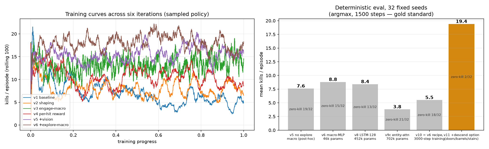

# AlphaDiablo / DiabloGym

[](https://github.com/Diabolically-Handsome/AlphaDiablo/actions/workflows/ci.yml)

**A fast, deterministic Diablo I reinforcement-learning environment** built on
[DevilutionX](https://github.com/diasurgical/devilutionX), plus the training
pipeline that took a PPO agent from *hiding in a corner* to *opening doors,
smashing barrels, looting potions and fighting its way down through the
dungeon* — fourteen documented runs, one diagnosed failure mode eliminated
(or one hypothesis falsified) per run.

- 🚀 **~13,000× realtime**: full game logic, headless — 254k engine ticks/s raw,
  ~7,500 `env.step()`/s with full observations (M-series MacBook, measured)
- 🎲 **Deterministic**: `reset(seed)` owns the dungeon seeds *and* the global RNG
  stream; evaluations are bit-reproducible across processes (verified per-seed,
  see protocol notes in [train/evaluate.py](train/evaluate.py)); engine source
  pinned to an exact upstream commit by [bootstrap.sh](bootstrap.sh)
- 🧩 **Gymnasium API**: structured observations (entity features + 11×11 local
  map + potion/gear preconditions), macro-actions (engage / explore / advance /
  drink / pick-up-potion / pick-up-gear)
- 📊 **Zero-dependency live dashboard** for training runs
- 🩹 Ships registered, reproducible **DevilutionX integration patches** — asset
  fallbacks, monster-missile anims (a bat swoop was the first crash), unloaded
  SFX handling, and headless in-game-movie suppression (Lazarus was another
  deterministic crash) — in `patches/`



*Left: training-time kills (sampled policy, rolling 100) across the six
iterations that built the champion. Right: the gold standard — deterministic
(argmax) evaluation on 32 fixed seeds. Full run-by-run post-mortems in
[docs/DESIGN.md](docs/DESIGN.md) (Chinese; lesson summaries below).*

## Results (32-seed deterministic gold standard)

| model | params | mean kills | median | max | zero-kill | reached L2 |
|---|---|---|---|---|---|---|
| v5 vision, no explore macro¹ | 45,771 | 7.6 | 0 | 45 | 19/32 | 0/32 |
| v6 macro-MLP | 45,836 | 8.8 | 3.5 | 36 | 15/32 | 0/32 |
| v8 LSTM-128 | 451,596 | 8.4 | 3.0 | 43 | 13/32 | 0/32 |
| v9c entity-attention | 701,980 | 3.8 | 0 | 38 | 21/32 | 0/32 |
| v10 = v6 recipe, 3000-step episodes | 45,836 | 5.5 | 0 | 49 | 18/32 | 0/32 |
| v11 = v6 + descend option | 45,901 | 19.4 | 14.5 | **70** | 2/32 | **27/32** |
| v12 = v11 + belt-potion action | 45,966 | 12.3 | 10.0 | 46 | 9/32 | 26/32 |
| **v13 = potion system made learnable (champion)** | 46,543 | **35.2** | 29.0 | 65 | 1/32 | 25/32 |
| v14 = v13 + auto-equip gear | 47,120 | 28.0 | 26.0 | 67 | 1/32 | 19/32 |
| v15 = v14 + AC-gain reward shaping | 47,120 | 31.3 | 30.5 | 66 | 2/32 | 19/32 |
| v16 = v15 + gear-key action masking | 47,120 | 34.5 | **33.5** | **80** | **0/32** | 18/32 |

¹ *Evaluated post-hoc on the current env (same observation; it never selects
the explore macro). Protocol: seeds 9000-9031, 1500 steps, argmax, idle
machine, pinned engine — [train/leaderboard.md](train/leaderboard.md).*

Honesty notes: each row is a **single training run** (v1-v10 unseeded; v11
onward uses `--seed`), and a 32-seed mean has an SEM of ≈2 kills — so the
v5/v6/v8 means are statistically indistinguishable and ordering claims rest
on the distribution shape (median, zero-kill), not the means. The v11 jump,
by contrast, moves every column at once and is far outside that noise band.
v13 is the first config with a same-config seed repeat (means 35.2 and
38.1 — the effect is robust), and the repeat taught us something the level
could not: deaths (12 vs 21/32) and drink discipline (93% vs 46%
real-share) vary wildly between runs of the same config. *How much* it
wins is reproducible; *how* it wins is not. v14's registered predictions
went **0/5** — gear-equip rate ≥16/32 landed at **0/32** (six presses of
the gear key in 48,000 evaluation steps); the post-mortem is lesson 13,
and v13 remains champion. v15 (bounded AC-gain shaping, lesson 13's
cheapest prescription) went **2/4**: mean kills ≥30 hit (31.3) and deaths
≤11 hit at an **all-time low of 9/32** — but both gear predictions were
obliterated again (0/32 equips, *one* gear-key press in 48,000 steps),
and real-drink share drew 60%, the style lottery's fourth hand
(93/46/37/60%). Lesson 14; v13 remains champion. v16 (gear-key action
masking) went **3/4** and resurrected the button by intervention: 258
gear-key presses and **16/32 episodes equipped** (from one press and
0/32 in v15), plus three all-time firsts (median 33.5, max 80,
zero-kill 0/32) — but deaths ≤13 missed at 14, descent slipped to
18/32, and outcomes never followed the armor (7 of 16 geared episodes
died and dropped it, 3 broke it in combat). The no-op attractor,
evicted from the masked key, resettled on the drink/pickup keys:
real-drink share crashed to 3.7% (fifth hand; the PPO→MaskablePPO swap
is a registered confound). Lesson 15; v13 still holds mean kills and
descent.
Leaderboard checkpoints are not distributed yet (a tagged release is
planned); rows come from the author's runs and are deterministically
re-evaluable given the checkpoint. Champion honesty numbers: v13's
pre-registered predictions went **2/4** — real-drink share >50% and mean
≥16 hit; deaths ≤10 **missed** (12/32), reached-L2 ≥26 **missed** (25/32).
Deaths did fall 17/32 → 12/32 while the kill rate nearly doubled, but one
seed (9001) migrated the v12 idle-spam attractor onto the new pickup key —
1,448 no-op presses (lesson 12). Observation changes (286→290 in v13, 290→294 in v14) end
direct re-evaluation of older checkpoints on the current env; each row
stands on the env version it was scored under (same policy as v1-v4/v7).

### Deep-water chapter (v17+, separate board)

The gear/survival economy moved to its natural habitat: 3000-step
episodes with a depth-progressive descent ladder (level N→N+1 pays 8×N),
scored on [train/leaderboard-deep.md](train/leaderboard-deep.md) — not
comparable to the table above. The opener (v17) transformed the species
with one reward knob: depth median L3, 11/32 episodes touch L4 (the old
chapter's deepest-ever), 28/32 leave L1 — but as a level-1 stair-rusher
that farms nothing, wears nothing, and dies in 22/32 episodes, 16 of
them with a dry belt. The ladder priced *touching* depth, not
*surviving* it, and the policy solved the prices as written (lesson 16).
v18 applied the lesson's single knob — death now costs 8×level — and
the pendulum swung hard back: kills 9.6 → 32.1, the armor audition
finally convened (15/32 episodes equip, after farming resumed and
drops existed again), dry deaths fell from 16/22 to 4/19… and depth
retreated (median L2, one L4). Its dead now die fully stocked: at
character level 1-2, the L2-L3 monsters burst faster than a belt can
heal. The bottleneck has moved twice in two generations — sampling →
resources → character power — and the farm-then-dive spiral exists in
embryo (the five episodes that descended at level ≥2 are the best on
the board).

Four findings we did not expect:

1. **At this scale, task design beats architecture** (directional evidence,
   one run per architecture). With a 3M-step budget, a 46k-parameter MLP
   equipped with two hand-built macro-actions matches a 10×-larger LSTM, and
   a 15×-larger entity-attention model never trained stably — even with
   double the budget (6M steps) it ended at 3.8. The single-episode max is
   too noisy to rank architectures (the memoryless v5 hit 45; the LSTM 43).
   The wins came from reward attribution, action granularity and an
   exploration option — not from bigger brains.
2. **The remaining failures are dead zeros, not slow episodes.** Doubling the
   evaluation horizon to 3,000 steps changes *nothing*: per-seed kill counts
   are bit-identical at both horizons for both v6 and v10, all 32 seeds. When
   the spawn pocket has no reachable prey, the agent never recovers — a
   planning/exploration failure, not a time budget one.
3. **Capability lives in the action space, not the parameter count.** The
   dead zeros turned out to be a *sensor* problem: closed doors are
   indistinguishable from walls in the walkability channel, so part of every
   level is invisible-by-construction. A static "sealed spawn" analysis
   predicts zero-kill episodes for the MLP, the LSTM and the attention model
   with zero false positives (15/15 cells) — information destroyed at the
   sensor is unrecoverable by any downstream architecture. v11 added **one
   action** (a descend option that plans through doors/barrels with a
   full-map BFS and operates them en route), left observation, rewards and
   architecture untouched, and doubled the gold standard — where a 15×
   parameter increase had previously *lost* points. Emergent bonus: on the
   deepest sealed seed the policy uses the descend macro as a *door-opening
   key* and farms the unsealed rooms without ever taking the stairs.
4. **One observation bit made the potion economy learnable — and nearly
   doubled the champion.** v12 and v13 share the same drink button. v12
   could not see the belt and spent 99.5% of its presses on an empty one;
   the seed-13 run of v13 spends 93.4% of its presses on a stocked one (25
   of 57 argmax drinks below half HP, the deepest at 1% HP), and the mean
   jumped 19.4 → 35.2. The seed-14 repeat keeps the kill level (38.1) but
   only 45.7% discipline (pooled: 65%) — the *capability* is unlocked by
   observability (lessons 5, 11, 12); how thoroughly a given run exploits
   it is seed lottery.

### Seventeen lessons from twenty runs (short version)

1. Don't tax the intermediate costs of the behaviour you want, and don't leave
   zero-cost sanctuaries in the reward landscape (v1's wall-hugger).
2. Shaping must be attributed to the agent's own actions — monsters walking
   toward you is not progress (v2's fishing exploit).
3. When atomic actions are finer-grained than the task's causal structure,
   package them as temporally-extended options (v3's engage macro).
4. Densify rewards on conserved task progress (damage fractions), never on
   countable events (swing counts) — anything countable gets farmed (v4).
5. Rewards can only cash in information that exists in the observation; when
   failures cluster spatially, fix perception first (v5's 11×11 map).
6. Don't force a reactive policy to learn planning — wrap planning as an
   option and let the policy choose (v6's explore macro: the median episode
   went from 0 kills to 3.5 and zero-kill episodes from 19/32 to 15/32; the
   mean gap, +1.2, is within eval noise).
7. Macro engineering has degenerate attractors: each patch bred a new exploit;
   after three patch rounds (v7-v7d) we froze the interface instead.
8. Eight evaluation seeds lied to us in *both* directions (champion inflated
   77%, v5 deflated 15%); 32 fixed seeds, argmax, frozen protocol — and treat
   machine load as part of the protocol.
9. Architecture upgrades pay off only when the bottleneck is the brain: the
   LSTM matched but didn't beat the macro-MLP; attention never trained
   stably; doubling episode length changed nothing. The bottleneck is the
   spawn-pocket deadlock — task structure again.
10. Perception bounds what can be known, the action set bounds what can be
    done, architecture only tunes the efficiency in between (v11: one new
    option, +120% mean kills; v9c: 15× parameters, −57%). Audit those three
    layers in that order — the cheapest miracles live in the action space.
11. A new action is also a new hiding place. v12's drink action did its
    designed job on a few seeds (one argmax clutch heal from 8.6% HP) and
    deaths fell 17/32 → 10/32 — but mean kills regressed 19.4 → 12.3, and
    4,715 of 4,740 presses hit an empty belt. The belt count was
    deliberately kept out of the observation (protocol comparability), so
    the policy could never learn when *not* to press: lesson 5 applies to
    action preconditions too. Door-blindness, then bottle-blindness —
    self-inflicted this time. v11 keeps the crown.
12. Discipline is a function of observability, and hiding places are
    conserved. Giving the policy eyes on the belt (v13) turned 99.5% waste
    into 93.4% discipline and doubled the champion — but the idle-spam
    attractor from lesson 11 did not die, it migrated: one seed presses the
    new pickup key 1,448 times as its no-op corner, and the seed-14 repeat
    grew that to three seeds (one spends its *entire* 1,500-step episode on
    the key). Remove a hiding place and risk-averse probability mass flows
    to the next zero-risk action; budget for attractor migration whenever
    you add one — and only trust behaviour-composition claims that survive
    a seed repeat.
13. The reward stream is the last observer. v14 made gear preconditions
    fully observable (AC + nearest wearable in obs, auto-equip wired,
    probes green) and the policy still pressed the gear key 6 times in
    48,000 evaluation steps, equipping nothing: armor's consequence — a
    few percent less damage spread over hundreds of steps — is invisible
    to a 3M-step credit-assignment horizon. Perception bounds what can be
    known (5), the action set what can be done (10), the reward horizon
    what can be *learned*. A capability chain is only as strong as its
    least observable link: precondition → policy, consequence → learning
    signal.
14. Shaping amplifies; it does not summon. v15 paid a bounded one-shot
    bonus (+0.5 per AC point) the moment armor went on — lesson 13's
    cheapest prescription — and the policy pressed the gear key *once*
    in 48,000 evaluation steps (v14: six times). A shaping term only
    bends the value function along trajectories exploration actually
    completes; when the event chain (gear spawns → enters the obs →
    macro walks → auto-equips) is a product of small probabilities, the
    bonus is sampled too thinly to outweigh the key's ever-present cost,
    and the button dies anyway. Bootstrap the *event*, not the reward:
    demonstrations, forced-equip resets, or a gear-rich environment
    first — then shape. (The run itself was healthy: deaths hit an
    all-time low of 9/32 and kills held at 31.3 — a v13-class fighter
    that simply never touched its newest toy.)
15. Masking moves probability, not value. v16 masked the gear key to
    exist only when gear is in view, and the button resurrected
    overnight: one press per 48k steps → 258, equips 0/32 → 16/32 —
    lesson 14's mechanism confirmed by intervention. But outcomes did
    not follow: deaths and descent slipped, cheap L1 gear drops on
    death or breaks in combat, and wild macro completion stayed at the
    forced-press probe's ~6%. A mask can put a button back on the
    menu; it cannot make the goods worth buying — that is the task
    economics' job, and a 1500-step L1 episode cannot amortize armor.
    And the no-op attractor obeys conservation (lesson 12, third
    strike, cleanest yet): evicted from the masked key, it resettled
    on the unmasked drink/pickup keys. Structural hygiene relocates
    spam; only value can retire it.
16. You buy the behavior you price, not the behavior you mean. v17's
    escalating descent ladder (8/16/24 per level, death at −2) priced
    "touching depth" above everything, and the policy obliged: median
    first descent at step 138, every descent at character level 1,
    kills 34.5 → 9.6, deaths 22/32 — and the armor audition never
    convened (zero gear-key presses: no farming → no drops → nothing
    to wear). The knob steers at full power; it steered to the letter
    of the prices, not their intent ("survive at depth"). Rebalancing
    the auction — a death cost scaled to the ladder — is v18's single
    knob. Sixteen generations in, the constant: the agent solves your
    reward, never your intention; task design is where the
    intelligence lives.
17. Audit the world before you debug the agent — and when the books
    are honest, a refusal is a measurement. Three deep-water knobs
    failed identically before we audited the environment and found a
    stat-point black hole: the engine grants 5 points per level, and
    for nineteen generations no code ever spent them, so the
    level→power exchange our rewards priced never existed — the agents
    had been *correctly pricing a broken economy* all along (v17's
    stair-rush was the closed-form optimum: 8×0.99¹³⁸ ≈ two kills).
    v20 repaired the mechanism (auto-spend, verified) and lengthened
    credit sight (γ 0.997), and the policy answered with quiet L1
    retirement: 31/32 never descend, deaths 4/32, the safest agent
    ever built here. That refusal closed the chapter honestly:
    melee descent from a level-1 start in 3000 steps is negative-EV
    even in a sound world — real players agree; the leveling spiral
    spans hours. Some tasks fail the agent; this agent failed the
    task, and it was right to. (Continuation paths, pre-registered:
    calibrated-spawn curriculum, or workstation-scale horizons.)
    **Correction, one day later (lesson 18 in the making):** a scripted
    oracle grid (8 hand-written strategies × 32 fresh seeds × 3
    horizons) falsified this lesson's economic claim. A
    fight-while-descending script ("spiral": clear what you can, then
    go down, accept death around L3-L4) earns 2.5× retirement's return
    at 3000 steps already — 39.9 vs 15.9, 26/32 paired wins — despite a
    94% death rate. The learner's refusal was correct *among the modes
    gradient descent could reach* (rush and retire are both local
    optima; the winning ridge lies in the valley between them), not a
    measurement of the task's ceiling. Amended principle: respect the
    policy's "no" as evidence about the *optimization landscape*, never
    about the *task ceiling* — ceilings are measured with oracles, not
    inferred from silence.

## Quickstart (macOS, Apple Silicon)

The native bridge links a separately built DevilutionX dylib, so this project is
currently supported from a source checkout with an editable install only. A
standalone wheel is not a portable/runtime-complete artifact.

```bash
# 0. Requirements: Homebrew, Xcode CLT, Python ≥3.11
python3 -m venv .venv && .venv/bin/pip install -e ".[train,build]"

# 1. Game data (pick one):
#    - Free shareware (dungeon levels 1-2, no quest monsters):
mkdir -p "$HOME/Library/Application Support/diasurgical/devilution"
curl -L -o "$HOME/Library/Application Support/diasurgical/devilution/spawn.mpq" \
  https://github.com/diasurgical/devilutionx-assets/releases/download/v5/spawn.mpq
echo "64427cd7c1ba904eaa2e0031c16a6b136d0ecef9abc888c5ff8344b459356e38  $HOME/Library/Application Support/diasurgical/devilution/spawn.mpq" \
  | shasum -a 256 -c -
#    - Full game: buy Diablo on GOG, extract DIABDAT.MPQ with `brew install innoextract`,
#      drop it in the same folder (see docs/DESIGN.md notes).

# 2. Engine + bridge (clones DevilutionX at the pinned commit, applies patches, builds)
./bootstrap.sh && ./build.sh

# 3. Verify: random agent + determinism + descend/seed-differentiation
.venv/bin/python tests/smoke_random_agent.py
.venv/bin/python tests/descend_seed_test.py

# 4. Current R7 combat-recovery campaign (the only publication path)
.venv/bin/python train/run_r7_combat_recovery.py status
.venv/bin/python train/run_r7_combat_recovery.py prepare-bc
.venv/bin/python train/run_r7_combat_recovery.py train-development
.venv/bin/python train/run_r7_combat_recovery.py eval-development
.venv/bin/python train/run_r7_combat_recovery.py train-production
.venv/bin/python train/run_r7_combat_recovery.py eval-final

# Optional live telemetry while the official trainer is running
.venv/bin/python train/dashboard.py        # → http://127.0.0.1:8787
```

For ordinary research runs, `train/train_ppo.py` remains available. Do not use
it directly for the combat-recovery candidate: the R7 launcher freezes the BC
and implementation identities, compares the pre-registered recipes over the
fixed multi-seed development cohort, independently retrains the selected recipe
with the production RNG, and opens the 256-pair final gate exactly once. Only a
final PASS atomically publishes `model_final.zip` with its receipt; a direct
trainer/evaluator invocation is deliberately ineligible for that chain.

`train/run_v4_combat_recovery.py` is the archived rev12 launcher. Keep it only
for forensic replay of its historical evidence: it is not compatible with the
current rev22 training contract and is not a current publication entry point.

Training checkpoints are published atomically and only after a complete PPO
rollout update. `--resume-from` restores the policy, optimizer and global step,
then starts a new environment trajectory; it is parameter-state continuation,
not a bit-for-bit crash snapshot of engine state, wrappers, or Python/NumPy/
Torch RNG state. Contracted Worker checkpoints therefore require the explicit
`--allow-environment-restart-resume` acknowledgement and persist an immediate
parent/generation receipt. A checkpoint whose latest collected rollout has not
been consumed by an optimizer step is rejected. Checkpoints without the current
training contract instead require `--allow-legacy-resume` for an explicit
one-time migration; neither operation is an exact-trajectory claim.
`--total-steps` must be an exact multiple of `--n-steps × --num-envs`; the
trainer rejects any remainder instead of letting SB3 silently overshoot it.
Checkpoint-derived warm starts and teacher overrides retain a manifest, but the
manifest is not trusted on its own: the source checkpoint must still exist, its
hash and archive must validate, and every exported policy tensor must exactly
match the source. Keep the source ZIP beside any long-lived export.

BC `PASS` JSON is likewise treated as a claim, not evidence. The worker gate
requires exactly the 128 registered demonstration seeds, rejects actions that
are permanently masked for workers, and recomputes held-out metrics from the
hashed demonstrations and policy. Manager and flat gates deterministically
re-run their registered demo and 7000–7031 replay pools against the frozen
policy before training; the verified result is cached only for that exact
policy/runtime identity within the process.

Evaluation protocol v4 makes the native action and worker-window semantics
explicit. Action 0 is a real wait barrier (it cannot inherit a pending attack);
every non-terminal policy boundary is settled to `PM_STAND` with
`future == tile` and empty path/destination state, and the engine beats needed
to finish a committed animation are charged to the action's step budget,
reward delta and option duration. Entity masks use actual
visibility/reachability; damage reward is paid only for a new per-monster HP
low; and an ordinary FARM-window boundary is a non-terminal transition in the
same underlying game. FARM exploration may open an ordinary closed door when
it leads to new floor, but it cannot consume stairs or mandatory-story
interactions owned by the progression manager. Its 140-microstep no-progress
clock is independent of a scene-local 1,800-microstep cumulative FARM budget:
real combat/exploration resets the former, while the latter guarantees that
the progression manager still receives time to dive. Protocol v4 keeps the
298/303-wide shapes, but shape equality alone is not treated as semantic
compatibility. The frozen V28/KING/root actor and critic receive a canonical
protocol-v3 view: feature 286 is unpacked back to `belt_heals / 8`, feature 296
continues to carry the legacy no-kill clock, and feature 297 is decoded back to
the old `exhausted` bit. The frozen M29 manager likewise receives the legacy
feature-286 heal count, feature-296 no-kill clock and feature-298 layer-time
value. Current no-progress and scene-FARM budgets still govern window handoff,
but are not silently substituted into those frozen input slots.

For the current worker, feature 297 also carries a reversible drink latch.
Before any successful drink it remains the old `[0,1]` exhausted value; after a
successful voluntary drink or reflex drain it moves to the disjoint `[-2,-1]`
domain. Applying `-v-1` recovers the legacy bit exactly. The latch closes
worker-owned action 12 for the rest of that FARM window, while the emergency
brainstem drain remains available independently.
The existing base-observation belt scalar likewise carries both integer
preconditions without adding a column:
`belt_heals / 8 + belt_free_slots / 128`. The free-slot subscale perturbs an old
input by at most 0.0625 and cannot overlap adjacent heal-count buckets. Worker
drink capability depends only on visible HP/belt state in the `[0.5, 0.75)`
envelope and the visible latch. Repeated worker-owned drinking is therefore
hard-disabled after either kind of successful consumption, rather than left to
a hidden teacher history.

Potion execution is native-certified, not inferred from a key press. The
native action accepts only instant healing-potion item IDs (a Healing Scroll is
not a potion) and reports success only when HP rises or the matching belt count
falls. Worker receipts distinguish the requested action from the action that
actually executed, so rejected action-12 attempts cannot satisfy an exploration
or publication gate. The action-9 explore macro also yields immediately when
HP falls below one half and an instant potion remains, allowing the emergency
drain to act instead of monopolizing another macro beat.

The engage/explore buttons are resumable option controllers. Their failed-target
rotation, sticky frontier and visited-floor tables never change which policy
actions are legal; they only implement the chosen engage/explore action, and a
failed-target table must cycle rather than permanently blacklist a reachable
target. Consequently the 295-vector is not advertised as the full native game
state (unseen dungeon geometry is inherently partial). Encoding those controller
tables as a strict flat-MDP state would require new target/map channels and would
invalidate every existing 295/298/303 checkpoint; v4 instead exposes all wrapper
clocks/counters that directly gate masks or FARM termination while keeping macro
scheduling (including first-visit novelty) inside the explicitly partial option.

Protocol v4 retains v3's monotonic dungeon-depth and Lazarus bridge rules.
Because the task cannot naturally carry the Staff of Lazarus back to Cain, the
bridge performs one narrow, observable equivalent turn-in after the agent has
genuinely operated the stand and picked up the staff. Progression actions route
only mandatory interactions; they do not auto-clear combat or optional content.
The full-game resource probe exercises this chain against a real DIABDAT.MPQ.
The training/evaluation identity includes the actual main MPQ, complete
Resources tree, exact numerical package versions and native binaries mapped
into the process; the bridge rejects a main archive found through cwd/system
fallback instead of the explicit `data_dir`.

These semantic breaks intentionally invalidate all pre-v4 BC reports,
demonstrations, baselines and calibrated experiment thresholds. Re-run
`train/bc_worker.py`, regenerate protocol-v4 baselines, and recalibrate any
experiment driver before enabling it. Historical drivers remain fail-closed;
their old archives are immutable forensic records, not valid comparison rows
for new training or model selection.

Evaluation archives use schema v5 for exact contribution, potion-economy, and
curriculum-stratum accounting. Per-seed
returns are stored at full floating-point precision, and every episode records
its actual micro-step count and one mutually exclusive terminal kind
(`death`, `victory`, `game_over`, `time_limit_idle`, or
`time_limit_unsettled`). The manager ledger is partitioned into FARM and
non-FARM returns/kills; FARM additionally records `R`, worker wage `W`, stripped
descent bonus, and the wage/kills attributable specifically to
`_win_step_worker`. Opening brainstem drains and fuse recovery remain in the
whole FARM window ledger but cannot masquerade as reward delivered to the
learned policy. Each row also records voluntary drinks, reflex drains,
multi-drink windows, the maximum voluntary drinks in any FARM window, and the
ending healing-potion stock. FARM window counts, worker wage, and worker kills
are additionally partitioned into dry and fresh strata, so a curriculum/eval
distribution mismatch can be diagnosed without weakening the total paired
combat gate. Archive validation recomputes all aggregates and rejects any
violation of return, wage, kill, stratum, potion, step-budget, or terminal-kind
conservation.
Consequently an increase in total assembled return can be distinguished from
an actual increase in learned FARM-worker combat contribution.

### Protocol-v4 R4 audit outcome

The latest causal audit found no evidence that a fixed preventive-drink rule
improves combat strength. In native short training, the contextual action-12
mixture started at probability 0.05 and moved slightly downward; earlier
deterministic preventive-drink grafts also reduced return without reducing
deaths. R4 therefore treats the rev10 contextual mixture as an optional
on-policy exploration route, with `bc_aux_lambda=0.0`, rather than a behavior
that imitation learning or the publication gate must force into deterministic
argmax deployment.

This does not weaken the evidence chain. Before a candidate can publish, its
receipt must still prove at least 20 expected action-12 samples and at least 10
native-certified executions; requested-but-rejected key presses do not count.
The paired 7000–7031 gate remains the known-seed regression screening test:
worker wage and worker
kills must improve under the registered mean/seed-majority rules, total return
and total kills may not fall, deaths may not rise, and repeated worker-owned
drinking must remain absent. Fresh evaluation is not opened unless that gate
passes; the one-shot paired 12000–12031 pool is the independent final efficacy
evidence.

R4 is isolated from the earlier R1–R3 directories and artifacts. At the rev10
snapshot its interfaces were `bc-worker-v2-demos/4`, `bc-worker-v2/5` and
`bc-aux-behavior/7`, under training contract revision 12 and auxiliary
objective revision 10. That identity remains a forensic record; the rev13
data-firewall identity below supersedes it for all new artifacts. Older
receipts or campaign state cannot be relabelled as current evidence.

### Protocol-v4 rev13 final-heldout firewall

The rev13 audit invalidated the 1000–1383 BC-v2 replacement pool. A
preselection post-drink coverage diagnostic had traversed its final domain
before candidate selection, so the final split was already observed even
though the old failure receipt said that it had not been read. That pool is
burned. The fresh, disjoint registries are now exactly 2000–2127 for BC-v1 and
3000–3383 for BC-v2; consumers require exact episode coverage and reject the
previous pools.

Preselection coverage is restricted to fit and validation, and final coverage
and model scoring cannot start until candidate selection has passed. Collection
itself nevertheless traverses the whole registered pool, so both v1 and v2 now
create the immutable marker **before the first episode reset**, rather than
waiting for final scoring. It uses exclusive creation plus file/directory
synchronization in the stable sibling registry
`train/runs/_bc_final_holdout_registry/`; renaming or archiving either artifact
bundle cannot make the pool appear unused. The final PASS report binds both the
pool hash and exact marker-byte hash, and every consumer recomputes both. A
same-generator terminal receipt is also searched in the canonical directory
and every `_previous` archive. Pool identity uses its own immutable
`bc-final-holdout-pool/1` schema; changing the marker file format cannot create
a new identity for the same episodes.

The fresh BC ranges are part of the ordinary-training seed exclusion table, so
PPO cannot accidentally replay a BC final episode. The historical 0.70
fallback is disabled because it had no independent fresh registry and would
have reused the 0.65 final pool; any future fallback must register a separate
training-reserved pool first.

The registry is append-only across later campaigns. After the
`2_100_000..2_100_127` v1 and `2_101_000..2_101_383` v2 pools were opened,
they remained permanently burned and training-reserved. After the `2_102_000..2_102_127` v1 pool was opened by a collection run that crashed mid-traversal (2026-07-27, WSL port: the action-14 fuse path lacked its native gear receipt), that range too became permanently burned and training-reserved — the one-shot marker held, exactly as designed. The current active producer/consumer ranges are `2_104_000..2_104_127` for v1 and `2_103_000..2_103_383` for v2. Both are disjoint from the R7 evaluation bank
`2_110_000..2_129_999`; ordinary training rejects all four old/new BC ranges.
Changing the active registration does not itself collect an episode—the
one-shot marker is still created only by the explicit BC producer immediately
before its first reset.

These repairs first ran as the isolated R5 campaign. R4 is retained as forensic
evidence of its failed pre-repair BC attempt; it never opened either the
7000–7031 regression archive or the 12000–12031 one-shot fresh archive. R5
therefore used new control, candidate, and evaluation namespaces, while the
BC one-shot registry remains stable and global to the pool rather than to an
artifact bundle or campaign directory.

R5 later stopped exactly as designed when nested-validation root-anchor TV
reached `0.155435 > 0.15` at global step 3,782,656. It published no candidate
and did not open the fresh pool. Its last periodic safe checkpoint, at
3,747,840, had TV `0.074768`; a known-seed forensic replay passed every
regression component (worker wage `+20.685`, worker kills `+7.5`, return
`+21.132`, total kills `+7.813`, deaths `-1/32`). R6 therefore preregisters an
exact replay of the same first 122 rollouts from v28: 249,856 continuation
steps, unchanged constant optimizer/curriculum prefix, and an exact expected
policy-head SHA. It does not relax the TV gate or resume the tripped model.
The 7000 replay is adaptive development evidence; only the still-unopened
12000–12031 paired fresh pool can provide the independent final verdict.

The action-12 boundary circuit was corrected at the same time. Its open upper
edge is centered at the exact registered threshold 0.65 with slope 100; the
old `+0.002` offset had moved that center to 0.652 and classified real
0.651163 negatives on the positive side. The fit-only recall target is now
0.75. Calibration also fails closed unless legal-negative action-12
probability has mean at most `1e-4` and maximum at most `1e-3`. The contextual
adapter preflight separately binds the fit and validation positive-probability
minimum, mean and maximum to the registered 0.05 target, so an average cannot
hide statewise drift. Its liveness receipt now also performs one real isolated
policy-gradient optimizer step on nested-validation positives, proves that
eligible `p(a12)` and gate bias increase under a favorable advantage, and
restores policy plus optimizer state before training. Final checkpoint
publication additionally requires a persisted receipt that the last full
rollout actually completed at least one PPO optimizer step.

Current BC-v2 identities are `bc-worker-v2-demos/5`,
`bc-worker-v2/7`, and `a12-teacher-boundary/3`; the behavior receipt remains
`bc-aux-behavior/7`, while liveness is
`bc-aux-liveness-preflight/4`. The earlier `/4`, `/5`, and calibration `/2`
artifacts remain historical only and cannot be upgraded by editing metadata.

## How it works

| Layer | Where | What |
|---|---|---|
| C++ bridge | `src/diablogym.cpp` | Embeds the whole engine as a shared library (`HeadlessMode`), drives the game loop tick-by-tick from Python, injects actions at the **network command layer** (same path as multiplayer — a trained agent can later join a TCP co-op game as a headless client) |
| Env | `python/diablogym/env.py` | Gymnasium env: 295-dim obs (player/monster entities + next mandatory-objective direction + 11×11 walkability & monster-occupancy map + belt/floor-potion fields + AC/nearest-gear fields + level/depth power gauge), `Discrete(15)` with engage/explore/advance/drink/pickup-heal/pickup-gear macro-actions, per-hit damage rewards |
| Training | `train/train_ppo.py` | SB3 PPO, subprocess vec-envs, per-episode JSONL metrics |
| Evaluation | `train/evaluate.py` | Frozen 32-seed deterministic protocol; appends to the leaderboard |
| Monitoring | `train/dashboard.py` | stdlib-only live dashboard (SVG charts, 2s polling) |
| Engine fixes | `patches/` | Registered headless/integration fixes, including town asset fallbacks and skipping Lazarus' movie without an SDL video subsystem; applied idempotently and drift-audited by `build.sh` |

Determinism notes: the engine reseeds its global RNG from the wall clock when
creating a hero (`CreatePlayer`) and paces turns against real time
(`nthread_has_500ms_passed`). The bridge re-seeds the global RNG from the
episode seed on every `reset()`, and the evaluation protocol requires an idle
machine — under heavy load a trajectory can slip by one logic turn. Both
quirks are documented in [train/evaluate.py](train/evaluate.py).

## Roadmap

- [x] v0 walking skeleton: embed, reset(seed), step, obs, actions
- [x] Phase 1 — autonomous fighter on dungeon level 1 (v6: 8.8 mean kills)
- [x] **Crack the spawn-pocket deadlock** — root cause was door-blindness in
  the walkability channel; the v11 descend option (door/barrel-aware BFS)
  cut zero-kill episodes 15/32 → 2/32
- [x] Descend to L2 — 27/32 episodes reach it now (deepest runs chain to L4)
- [x] Make the complete single-player action graph structurally reachable with
  the existing 15 actions: Staff/Cain adaptation, Vile books/circles, set-level
  return and all four L16 switches are covered by a real-DIABDAT probe
- [x] Survive down there: v12's blind drink action cut deaths at a kill-rate
  cost (lesson 11); v13 made the potion system *learnable* (belt count +
  nearest floor heal into the observation, door-aware pickup macro) —
  deaths 17/32 → 12/32 while mean kills doubled to 35.2
- [ ] Gear up: v14 wired auto-equip end-to-end (probes green) but the
  policy never learned to press the key — armor's payoff is invisible to
  the reward stream at 3M steps (lesson 13). v15 tried the cheapest fix,
  bounded AC-gain shaping, and the key was pressed *once* in 48k eval
  steps: shaping cannot summon a rare event (lesson 14). v16 masked the
  key to exist only when gear is in view and the button resurrected
  (16/32 episodes equipped) — but outcomes didn't follow: a 1500-step
  L1 episode cannot amortize armor, and a forced-press probe measured
  gear acquisition at −7 kills / +6 deaths even for free (lesson 15).
  The chapter moved to deep water: v17's 3000-step episodes with
  depth-progressive descent bonuses transformed the species (depth
  median L3, 11/32 touch L4) but overpriced rushing — a level-1
  stair-sprinter that farms nothing and wears nothing (lesson 16). The
  armor audition is still pending: v18 rebalances the auction (death
  cost scaled to the ladder) so surviving at depth, not touching it,
  is what pays
- [ ] Clear-rate objective
- [ ] The Butcher 🥩 (his greeting already crashed our headless engine once —
  see patches/0003; killing him is next)
- [ ] Cross-class generalization (Rogue / Sorcerer; the current contract rejects
  non-Warriors until class-specific action/stat semantics are implemented)
- [ ] Multiplayer co-op deployment (carry your creator through the game)

## Related work

[DevilutionX-AI](https://github.com/rouming/DevilutionX-AI) (Jan 2025)
independently built an RL framework on the same engine with a different
integration approach — an out-of-process shared-memory bridge driving a
running game, with an imitation-learning + PPO pipeline. Its master branch
documents a 0.98 success rate on level-1 goal-finding (sampling-mode
evaluation; its author notes argmax scores lower); its develop branch goes
much further — per-level descent episodes sampled across all 16 dungeon
levels, with melee plus seven spells, potion and mana-shield management, a
hierarchical manager/worker model (explorer and combat options) and a
level-weighted curriculum, at ~71% mean training success (per its author,
Jul 2026). DiabloGym differs in integration (engine embedded in-process
via pybind11), in evaluation discipline (argmax-only on frozen seeds,
pinned engine ref, idle machine), and in its product: the iteration ledger
itself — fourteen generations, every champion and every failed generation
documented with the lesson it taught. The roguelike-RL canon
([NLE](https://github.com/facebookresearch/nle),
[MiniHack](https://github.com/facebookresearch/minihack)) offers
turn-based, purpose-built research environments; DiabloGym instead wraps a
commercial real-time ARPG engine with an explicitly documented monotonic-task
adapter for the otherwise impossible Cain round trip.

## 中文速览

基于 DevilutionX 的暗黑破坏神 I 强化学习环境:无头引擎裸跑 ~13,000 倍实时
(含观测的 env.step 约 7,500 步/秒,~1,500 倍实时)、种子级确定性(评估跨进程
位级可复现)、Gymnasium 接口、宏动作(交战/探索/主线推进/喝药/捡药)、零依赖训练
监控面板。十四轮迭代把 PPO 从"面壁思过"练到"开门、砸桶、捡药续命、一路下杀"
(32 种子金标准均击杀 **35.2**,较上代冠军近乎翻倍;实喝纪律 0.5%→93.4%),
并留下十三课教训:奖励税、塑形归因、动作时序、防磨刀、感知天花板、探索
option、宏退化吸引子、评估运气税、任务设计>架构、能力住在动作空间、新动作
也是新藏身处、纪律是观测的函数而藏身处守恒、**奖励流是最后一位观察者**
(v14 装备键:前置条件全可观测,但护甲的收益对奖励流不可见——48,000 步
评估只按了 6 次,0/32 穿甲)——每一课都有数据实锤,完整踩坑史见
[docs/DESIGN.md](docs/DESIGN.md)。

## Legal

MIT for the code in this repository. `patches/` contains derivative snippets of
DevilutionX (Sustainable Use License — non-commercial); the build fetches
DevilutionX from upstream rather than vendoring it. **No copyrighted game assets
are included**: bring your own `DIABDAT.MPQ` (GOG) or use Blizzard's freely
available shareware `spawn.mpq`. Diablo® is a trademark of Blizzard
Entertainment. This is an unofficial research project, unaffiliated with
Blizzard Entertainment or DeepMind.
