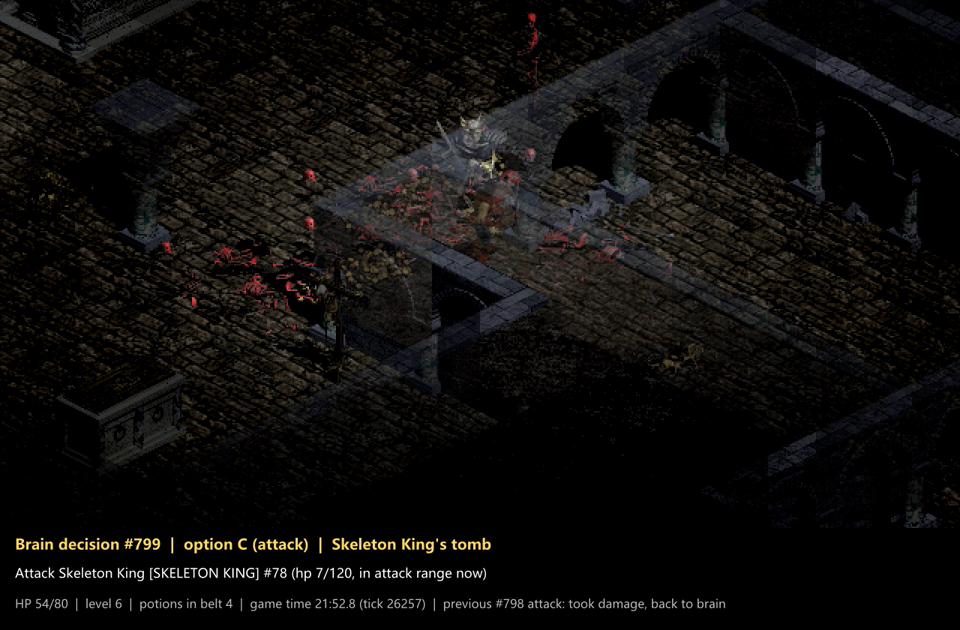

# AlphaDiablo / DiabloGym

[English](README.md) · **简体中文**

## 第九版：由本地微调模型做高层决定的智能体，在 16 个新世界里击杀骷髅王 13 次（2026-09-24）

**据我们所知，此前没有公开的工作展示过同时满足下面所有条件的暗黑破坏神 I 智能体：**

1. **本地运行、为这项任务微调的语言模型**：Mistral-Small-3.2-24B 加我们自己的 LoRA 适配器，4 位量化，跑在一张消费级显卡上；不是手写规则，也不是云端 AI 助手；
2. **每个高层决定都由模型做出**：每次从代码列出的选项菜单里选一项；
3. **正常开局**：新建的 1 级战士，普通难度，不注入金币、经验、物品或装备；
4. **不改战斗、掉落、价格、经验、任务和地图生成规则，不用作弊接口**：引擎补丁只有无头运行的防崩溃修补、只读接口、默认关闭且只能拒绝换层的钩子、价格和随机数用法不变的商店/卸装交易重构，以及一处上游存读档缺陷的修复（怪物属性削减字段）；桥里的测试探针一次都没有调用；
5. **在预注册考试里、在从未用过的世界上（除了开考前的 tick-0 任务检查）击杀首领**：骷髅王 **16 局杀 13 局**，屠夫 **16 局杀 10 局**，每次击杀时英雄都活着；同一个模型在更早的留出检验（非预注册）里是 **14 局杀 9 局**和 **16 局杀 8 局**；
6. **上述每一次击杀都用引擎的原生命令日志重放核对过**；
7. **用适配器重算过决定**：抽查的 2,000 个考试决定（以及第 8 轮 41,684 个决定中重算过的全部 39,743 个；其余 1,941 个来自训练世界对局，没有重算），重算后概率最高的选项全部与记录一致。

这是对上述组合的说法，欢迎指正。规则机器人（2021 年，有人工介入）和工具辅助速通（2024 年）都打通过暗黑 I，强化学习智能体也和屠夫交过手（见[相关工作](#相关工作)）。这不是整局通关，也不是基准测试成绩。下面的说明是这个说法的一部分。

[▶ 骷髅王战，144 秒](https://github.com/Diabolically-Handsome/AlphaDiablo/releases/download/round9-stable-kills-20260924/exam9-king-kill-4150097.mp4)
· [▶ 屠夫战，56 秒](https://github.com/Diabolically-Handsome/AlphaDiablo/releases/download/round9-stable-kills-20260924/exam9-butcher-kill-4150078.mp4)
· [发布页](https://github.com/Diabolically-Handsome/AlphaDiablo/releases/tag/round9-stable-kills-20260924)
· [考试报告（英文）](docs/rounds/round9-exam.md)
· [实际运行的代码（英文）](option_brain/README.md)

| | 骷髅王 | 屠夫 | 死亡 |
|---|---|---|---|
| **第 9 轮考试，发布的模型**（27 个新种子，32 局，2026-09-24） | **13 / 16** | **10 / 16** | 6 / 32 |
| 第 8 轮留出检验，同一模型，旧版代码（30 个新种子，2026-09-23）† | 9 / 14 | 8 / 16 | 5 / 30 |
| 第 9 轮考试，候选模型，只跑了前半组（未采用） | 3 / 8 | 5 / 8 | 3 / 16 |

† 非预注册，见[考试报告（英文）](docs/rounds/round9-exam.md#what-was-compared)。

「第九版」指适配器 `d9facts3`（第 8 轮训练）配第 9 轮代码。权重不公开，只公开 sha256：
`1d3b24942f1a2a5825f5aa8ab7a000b1d5cb27639c33ee889e4ce13dd0a6dd72`。基座是
`mistralai/Mistral-Small-3.2-24B-Instruct-2506`，revision `95a6d26c4bfb886c58daf9d3f7332c857cb27b43`。

### 引用这些数字之前请先读

- **模型思考时游戏是暂停的。** 模型和游戏按拍同步：平均约每 47 个游戏 tick 做一个决定，也就是游戏时间每 2.3 秒一次（每秒 20 tick）。人类玩家做不到这样暂停。
- **菜单由代码生成，代码会藏掉一部分选项**：例如屠夫任务里 2 层的下楼（3 层的下楼一律不列）、刚失败或没起作用的选项、本趟进城刚买的东西不许卖、会直接撤销上一步的动作。发布模型的考试局里，光菜单规则就在 26.6% 的决定里至少藏掉一个选项，撤销守卫在 16.8% 的决定里藏过。
- **结论行由代码计算**，根据引擎的数据和公式得出，再交给模型：打首领的命中率、杀死首领需要的刀数、需要的治疗药数，以及「就绪 / 还没就绪」的判定，判定的门槛是我们定的。模型打不打首领，大体跟着这条判定走。
- **「手」是代码**：走路（最短路）、连刀和选目标、追击、把药挪进腰带（自动整理腰带）、关商店窗口。喝药、加点、买卖由模型直接下令；近战循环里有一个冻结的小强化学习网络，但第 8 轮实测它每一拍都选「攻击」。
- **老师标签来自基于 Claude 的老师工作流，以及更早的示范**（一个 OpenAI Codex 助手）。训练方法是模仿学习（含 DAgger），不是强化学习；老师还读过一份模型看不到的书面守则。
- **考试对比了发布的模型和一个新候选，新候选未被采用**（配对的半组里 8/16 对 12/16）。考试在 4 波里跑完 3 波后被叫停，受影响的只有候选那一臂（它的后半组跑了约 10 分钟就被叫停，不算成绩）。候选模型本身有一项离线判据没过，但考试仍获批准开考。
- **发布模型的 32 局考试里死了 6 局**（前半组 1 局，后半组 5 局），死时腰带和背包里都已没有治疗药，其中 5 局死在地牢 2 层、人物 2–4 级。
- **局限**：没有整局通关；首领只到骷髅王；这里用的桥不许下到 3 层以下；只有战士、普通难度；首领战场在每个暗黑 I 世界里都是固定地图，所以「新世界」指的是去首领那里的路是新的；样本小。「预注册」指开考前用 sha256 冻结的内部文件，没有外部时间戳。

表格、细节和核对证据见 [docs/rounds/round9-exam.md](docs/rounds/round9-exam.md)（英文）。

## 里程碑

- **2026-09-24，第九版：第 9 轮考试**（本次发布）。在 27 个新种子上做预注册的配对考试：发布的模型骷髅王 13/16、屠夫 10/16；候选模型未采用。[报告](docs/rounds/round9-exam.md) · [代码](option_brain/README.md)。
- **2026-09-23，本地选项脑与留出检验。** 同一个本地模型（`d9facts3`）先在训练世界里杀掉了两个首领，然后在 30 个从没跑过的种子上（留出检验，非预注册）：骷髅王 14 局杀 9 局，屠夫 16 局杀 8 局。当天 50 局事后全部按日志重放核对。随本次发布一起公开（数字见上表和考试报告）。
- **2026-09-21，第一次击杀骷髅王（在线策略脑）。** 一个 OpenAI Codex 智能体当策略脑（开局阶段用的是 Ministral 3 8B），加冻结的强化学习工人和明确的导航、服务执行，在一个暂停、分段、允许活着撤退后重试的世界里完成（前两次遇到骷髅王都活着撤退了）；击杀时英雄 96/96 血，没有更新任何权重。发布的录像只有开局和最后一战，不是完整的 46:59。[证据与局限](docs/milestones/2026-09-21-skeleton-king/README.zh-CN.md) · [发布页](https://github.com/Diabolically-Handsome/AlphaDiablo/releases/tag/skeleton-king-first-kill-20260921)。
- **2026-09-13，第一次击杀屠夫。** 混合系统：行为克隆的战斗策略、强化学习的探路策略，加脚本化的资源和装备管理，从 1 级开局到 6 级击杀（结束时 83/110 血）。它在两个重复使用的开发开局里赢了一个；重跑赢的那个开局复现了结果，但这不是独立样本。[证据与局限](docs/milestones/2026-09-13-butcher-first-kill/README.zh-CN.md) · [60 帧流畅版说明（英文）](docs/milestones/2026-09-13-butcher-smooth-video/README.md) · [发布页](https://github.com/Diabolically-Handsome/AlphaDiablo/releases/tag/butcher-first-kill-20260913)。

## 项目现状（2026 年 9 月）

- **做到了什么。** 从正常开局起，一个本地运行的语言模型在代码列出的选项里做选择，配上代码算的结论行和脚本化的手，在大多数新世界里杀掉骷髅王（13/16），过半的新世界里杀掉屠夫（10/16）。死亡主要发生在人物等级低、没有药时在地牢 2 层硬打。
- **还做不到什么。** 骷髅王之后的一切：这批对局用的桥只到地牢 3 层，也没有整局通关。第 9 轮训练的候选模型没能超过发布的模型；它在 19 个训练世界门槛种子上的进步，大部分是对这些种子的过拟合。
- **公开了什么。** 环境（C++ 桥和 Python 包）、训练和评测流水线、分层经理/工人路线（v22–v33）及其模型、R7–R19 的预注册战役和文书、里程碑证据，以及这次新加的选项脑代码、它用到的原生源码和考试工具（`option_brain/`）。**不公开的**：选项脑的适配器权重、执行器网络、训练数据、老师标签和我们自己的对局日志。

## 环境：DiabloGym（速览）

基于 DevilutionX 的暗黑破坏神 I 强化学习环境：无头引擎裸跑约 13,000 倍实时（引擎 tick 约 254k/秒；含完整观测的
`env.step` 在当前研究配置下约 300–500 步/秒/进程，瓶颈在 Python 侧观测抽取，2026-09-06 回执）、种子级确定性（评估跨进程位级可复现）、
Gymnasium 接口、宏动作（交战/探索/主线推进/喝药/捡药）、零依赖训练监控面板。

- **第一章**：二十轮迭代把 PPO 从「面壁思过」练到「开门、砸桶、捡药续命、一路下杀」（32 种子金标准均击杀 **35.2**；实喝纪律 0.5%→93.4%），留下十七课教训：奖励税、塑形归因、动作时序、防磨刀、感知天花板、探索 option、宏退化吸引子、评估运气税、任务设计>架构、能力住在动作空间、新动作也是新藏身处、纪律是观测的函数而藏身处守恒、奖励流是最后一位观察者、塑形只放大不召唤、掩码移动概率不移动价值、买到的是你定价的行为、先审世界再调智能体。
- **之后**：分层经理/工人（v22–v33），预注册战役 R7–R9（R8 认证 2026-07-28 通过），以及 R10–R19 各轮文书。
- 完整成绩表和十七课的英文版见 [README.md](README.md#the-environment-diablogym)；踩坑全史见 [docs/design/DESIGN.md](docs/design/DESIGN.md)（英文），文档索引见 [docs/README.md](docs/README.md)（英文）。

## 快速开始

支持的平台：**Apple Silicon 上的 macOS**（CI 构建和测试的平台），以及 **Linux x86-64，包括 Windows 上 WSL2 里的 Ubuntu 24.04**（当前开发机）。没有原生 Windows 版本，请用 WSL2。原生桥链接单独构建的 DevilutionX 库，所以项目从源码目录以可编辑方式安装运行。
命令见英文版 [Quickstart](README.md#quickstart)。游戏数据不随仓库提供：请自备正版 `DIABDAT.MPQ`（GOG），或使用免费的共享版 `spawn.mpq`。

## 仓库结构

| 路径 | 内容 |
|---|---|
| `src/`、`CMakeLists.txt`、`build.sh`、`bootstrap.sh`、`cmake/` | C++ 桥和构建脚本 |
| `patches/` | 登记在册的 DevilutionX 补丁，由 `build.sh` 应用并做漂移检查 |
| `python/diablogym/` | Gymnasium 环境，以及资源、拾取、续航协议模块 |
| `train/` | 训练器、评测器、BC 和导出工具、战役驱动、排行榜 |
| `train/models/` | 已公开的 v22–v29 经理和工人模型（v22、v23、v24、v28 附模型卡） |
| `option_brain/` | 第 9 轮考试实际运行的选项脑代码、考试工具、重放工具、bridge-r3 源码和引擎修复，附来源记录（[说明](option_brain/README.md)）；不含模型权重 |
| `tests/` | 单元和契约测试，以及 CI 跑的共享版运行时探针 |
| `docs/` | 设计笔记、预注册、法证、协议、轮次文书（英文；含[第 9 轮考试](docs/rounds/round9-exam.md)）和里程碑证据（[索引](docs/README.md)） |
| `tools/check_private_terms.py` | 推送前在本地运行的检查器（CI 不运行），防止私人词条进入任何受跟踪文件；词条及其哈希保存在仓库之外 |

除本文件、两份里程碑中文说明和少量为复现原始运行而保留原文的补丁行外，仓库里的文档、代码注释和提示信息均为英文。评测档案和检查点绑定 Python 源文件的 SHA-256，所以翻译前产生的评测档案和检查点只能对照产生它们的源文件复验或续训。

## 相关工作

- **NiteKat 的 DAPI 机器人**（作者自述为基于规则的专家系统）：频道观众剪辑的标题显示 2018 年杀了骷髅王，2021 年有盗贼单人通关视频（标题写明「有人工介入」），之后的剪辑显示杀过迪亚波罗、打到过地狱难度。我们只看了标题和元数据，没看视频。规则机器人更早杀过这两个首领，所以我们的说法只限于学习得到的模型。
- **DeepDungeon**（lciesielski，2026）：纯强化学习，作者说训练期间 14 个客户端累计杀了约 1.35 万次屠夫，但战士的强力装备是用开发者命令刷出来的。
- **rouming 的 [DevilutionX-AI](https://github.com/rouming/DevilutionX-AI)**：同一引擎上的强化学习框架。评测时开着屠夫但不统计击杀，所以不能排除它杀过屠夫；2026-08-21 起的整局监督程序由代码管城镇、楼梯和装备，并刻意避开屠夫。
- **TAS**（TASVideos 9396S，2024）：人手逐帧编排输入。

## 法律

本仓库代码采用 MIT 许可（[LICENSE](LICENSE)，项目声明见 [NOTICE](NOTICE)）。`patches/` 和 `option_brain/native/engine-r11-loadmonster.patch` 是 DevilutionX 的衍生片段，适用 Sustainable Use License（非商业）；构建时从上游拉取 DevilutionX，不随仓库附带。不分发编译好的引擎或桥，也不分发任何模型权重；选项脑的基座 Mistral-Small-3.2-24B-Instruct-2506（Apache-2.0）需从 Hugging Face 下载。**不包含任何受版权保护的游戏素材。** 录像是游戏的重放渲染，画面是暴雪的美术素材。Diablo® 是暴雪娱乐的商标。这是非官方研究项目，与暴雪娱乐、DeepMind、Mistral AI、Anthropic、OpenAI 均无关联。
