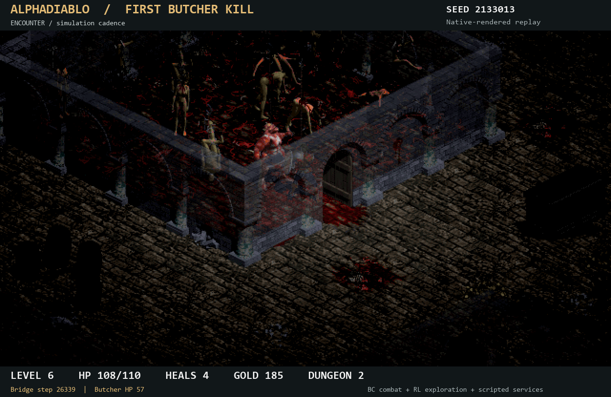
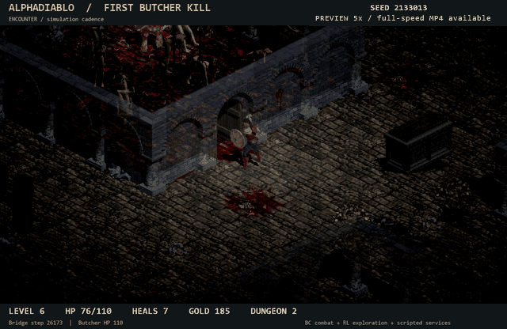

# From level 1 to the Butcher: our first reproducible kill

September 13, 2026 · [中文](README.zh-CN.md) · [Video and downloadable media](https://github.com/Diabolically-Handsome/AlphaDiablo/releases/tag/butcher-first-kill-20260913)



**AlphaDiablo has defeated the Butcher from a level-1 start under its current
research protocol.** The Warrior reached level 6, killed the Butcher, and survived
with **83/110 HP and one healing item left**. An unchanged replay reproduced the
same result and nine physical audit artifacts exactly.

The distinguishing challenge here is progression: earning experience, collecting
loot, buying supplies and choosing equipment before fighting the boss, rather
than starting with preloaded endgame equipment. This was not a level-1 boss kill.



*5x-speed preview. The release MP4 shows the encounter at the recorded simulation cadence.*

## What actually happened

| Recipe | Reused development seed | Kills / character level | Butcher | Warrior |
|---|---:|---:|---|---|
| Previous equipment score | 2133010 | 224 / 5 | Not killed | Died |
| Previous equipment score | 2133013 | 254 / 6 | Not killed | Died |
| Corrected equipment score | 2133010 | 170 / 4 | Not killed | Died |
| Corrected equipment score | 2133013 | 274 / 6 | **Killed** | **Alive, 83/110 HP** |
| Unchanged replay of winner | 2133013 | 274 / 6 | **Killed again** | **Alive, 83/110 HP** |

The candidate therefore has **one win and one loss on two reused development
starts**, not an established 50% generalization rate. The repeated winning start,
including the later recording replay, does not increase the independent sample
count. No previously unconsumed validation pool was opened for this milestone.

Initial state: normal-difficulty level-1 Warrior, 70 HP, 100 gold and two healing
items, at the start of dungeon level 1. No extra XP, equipment or healing items
were injected into these games. Twelve successful price-bearing purchases in
the winning run were checked against their actual before/after gold balances.

The Butcher was first seen at bridge step 26,173; his native quest changed to
DONE at step 26,505 while the Warrior was alive. All 33 recorded worker decisions
during the encounter selected and executed the combat macro `a9`. The bridge
executes four engine ticks per step at the protocol's 20-tick/s game rate.

## What is learned, and what is scripted?

- **Combat/FARM:** `w1-s2449001`, an 85,329-parameter policy trained by behavior
  cloning from scripted demonstrations. Its selected checkpoint is epoch 30,
  optimizer step 2,430. This is imitation learning, not a newly PPO-finetuned
  combat policy.
- **Exploration/DIVE:** the previously trained R16 policy.
- **Coordination and services:** task routing, action macros, town supplies,
  retreats, equipment scoring and other resource-management rules are scripted.
- **Inputs:** structured engine observations, not screen pixels or a human
  keyboard/mouse interface. The video renderer is not the policy's input.

There was **no additional model training in the equipment-scoring experiment**.
The fixed models became able to finish this particular run with a changed
equipment-selection rule and its resulting route/resources. This does not mean
the neural network has newly learned how to value equipment.

## The bug that mattered

The previous equipment score capped raw melee accuracy *before* accounting for
enemy armor. That could make useful accuracy bonuses look worthless. The
task-specific correction evaluates:

```text
melee hit chance = clamp(raw melee piercing to-hit - reference armor, 5, 95)
reference armor = 50  # fixed, public normal-difficulty Butcher assumption
```

It does not change the game's attack-resolution formula or grant an accuracy
bonus. It changes how the agent's scripted equipment selector ranks gear. The
reference is fixed task knowledge, not a read of an unseen current monster.
The [implementation diff](source/gear-hit-score.patch) and its source identities
are included as archival evidence; the diff targets the recorded pre-experiment
source, not the current public main branch.

Both scoring modes passed seven native engineering checks. In the winning route,
the Warrior reached the encounter with 23 armor, intact 30/30 chest armor, a
shield and seven healing items. The previous route reached it with 19 armor,
8/18 chest durability and four healing items.

**Causal limit:** both routes had the same raw melee accuracy of 86 at first boss
contact. We have not isolated armor, potion quantity, weapon and route effects.
The score also enters observations/rewards, so this is not an experiment where
only the final weapon changes and every other trajectory is held fixed.

## Rule differences we disclose

“No preloaded endgame gear” does not mean “identical to every vanilla human rule.”
The existing `a14` equipment macro automatically identifies picked-up equipment
without a separate identification charge. Scripted services and macro-actions
also simplify control. These inherited rules were unchanged between the two
scoring modes, but matter for comparisons with other projects or human play.

We make **no world-first, no-assistance, pure-RL, stable-success, or full-game
completion claim**. Earlier AI Butcher demonstrations exist, including
[DeepDungeon](https://github.com/lciesielski/DeepDungeon), whose author explicitly
discloses developer-spawned strong equipment. That is a different task setup,
not a reason to dismiss their work.

## How the kill and recording were checked

The native companion reads the active engine's `Quests[Q_BUTCHER]`. The underlying
monster-death path sets the Butcher quest to DONE; a Python reward or a low boss
HP estimate is not accepted as proof. The native quest state, first-DONE liveness,
final liveness, result row and physical audit files were cross-checked.

The video is **a native-rendered replay, not a screen recording of the original
headless trial**. For each image, a disposable fork child copies the exact live
state, loads graphics, renders with the pinned engine's dungeon renderer, and
exits without running game logic. The parent continues the unchanged headless
game. Recorded gameplay must match the original result, quest state and all nine
physical audit artifacts before any video is published.

The opening portion shows selected progression snapshots, clearly labelled as
such. The encounter portion includes every recorded bridge-step frame at the
corresponding 5 frames/s simulation cadence, displayed at 10 fps by repeating
each frame. Native dungeon art is used, with a fixed display palette and an
added informational HUD. There is no captured game audio. This is display-only;
the renderer is not used to generate policy decisions or gameplay evidence.

## Evidence package and reproducibility boundary

- [Machine-readable summary](evidence/summary.json)
- [Native completion audit](evidence/completion-audit.json)
- [Original unchanged replay check](evidence/original-replay-verification.json)
- [Recording replay check](evidence/video-replay-verification.json)
- [Winning run artifacts](evidence/winner/)
- [Previous-recipe and failed-candidate results](evidence/comparisons/)
- [Public file checksums and archival source identities](manifest.json)
- [Standalone evidence checker](verify.py)

Run the evidence checker from a normal Python installation, without game assets:

```sh
python docs/milestones/2026-09-13-butcher-first-kill/verify.py
```

This publication contains **results, selected evidence, implementation diff and
media**, not a self-contained training/runtime or checkpoint release. The exact
frozen runtime and model checkpoints are retained locally and identified by
SHA-256. Some experimental dependencies are not part of public main. Therefore
the checker validates the published evidence; it does not rerun the full game.
No MPQ archive, extracted game-asset bundle, save file or checkpoint is distributed.

JSON files are reserialized for publication; machine-specific loader paths are
removed from result copies. The manifest distinguishes published-file checksums
from original archive checksums. Failures are retained. No existing certified
model is replaced, and the repository's historical training results remain
separate from this milestone.
