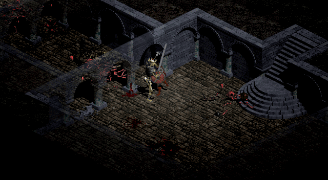

# 正常开局，骷髅王已击杀，角色存活

**一级战士从城镇出发，最终升到七级，击杀骷髅王，以96/96生命存活结束。**
原生击杀计数为1、骷髅王任务完成、角色未死亡，三项同时成立后立即停止。

时间：2026年9月22日UTC00:11。
[英文完整说明](README.md) · [结果数据](result.json)

[](https://github.com/Diabolically-Handsome/AlphaDiablo/releases/download/skeleton-king-first-kill-20260921/skeleton-king-final-fight-60fps.mp4)

## 录像与记录

- [最后一战：85.3秒连续录像，60fps](https://github.com/Diabolically-Handsome/AlphaDiablo/releases/download/skeleton-king-first-kill-20260921/skeleton-king-final-fight-60fps.mp4)。这一段保留全部1706个游戏tick、5118张原生显示子帧，包含喝药、受击、格挡及操作停顿。
- [同一局的开头：12分15.2秒连续录像](https://github.com/Diabolically-Handsome/AlphaDiablo/releases/download/skeleton-king-first-kill-20260921/normal-start-opening-12m15s.mp4)。这是保留的正常开局，不是第二次胜利，也不包含击杀。
- [下载页：录像、可选状态字幕、整局证据包和文件校验值](https://github.com/Diabolically-Handsome/AlphaDiablo/releases/tag/skeleton-king-first-kill-20260921)。字幕中的药量只计算腰带，不含背包。

**这两份视频不是整局连续录像。** 整局实际游戏时间为46分59.35秒；已发布开头
00:00—12:15.20，以及最后45:34.05—46:59.35。中间的视频仍未导出完成：旧导出器
在返回楼层时遇到了独特怪物尸体贴图关联故障。故障属于画面绘制，不是游戏死亡。

本次发布另做了一次只执行既有命令的重放，整局63153条记录的命令回执、状态校验
全部一致，只在最后一战打开绘图，最终成功。没有重新询问模型或重选动作。这也
不代表整局录像故障已修复；旧失败记录和原始帧全部保留。

视频是640×352游戏视口、无音轨。原生游戏逻辑20Hz，每tick呈现3张原生动画／
镜头子帧，得到60fps；不是AI补帧。双方思考时游戏暂停，这段现实等待不塞成重复
静止帧。MP4采用有损H.264，“片段不漏帧”不等于“像素无损”。

## 这局如何打赢

普通难度、一级战士、种子20260927。预先固定20260920—20260951的顺序，仅检查
是否生成骷髅王任务；前七个没有，第八个首次符合。没有按装备、掉落或地图难度
挑世界，没有加等级、装备、金币、药水或额外生命，也没有撤销死亡重来。

前两次攻王没有成功，但都活着撤离，损耗全部保留。第三次前继续打普通怪，正常
升到七级、将五点升级属性加给敏捷，付费鉴定掉落、修理、补药。最终用正常获得的
Morning Star of zest晨星锤（武器基础伤害1—10、+7体力），配小盾、皮甲和骷髅帽。

第三次进入王室有20瓶治疗药。策略助手指定站位，冻结工人出刀，助手明确命令
喝了7瓶药，最后剩13瓶。终局为：**七级、经验28179、32护甲、736金币、186击杀，
生命96/96**。立即停在成功时刻，没有为了录像继续播放死亡动画或拾取王冠。
本世界的屠夫未被击杀；以前的屠夫成绩属于另一局，不混在一起。

## 这是谁的成绩

这是**OpenAI Codex 智能体担任的策略助手＋冻结RL工人＋明确的导航与服务执行**的成绩。
开头曾由Ministral 3 8B操作，累计1624次请求；之后8850条执行记录分别标明了
工人攻击、导航头、助手服务和等待。游戏允许暂停思考，不是“真人实时反应”成绩。

没有训练或改权重。最终战斗保留原生格挡、受击、未命中和攻击中断。早期工程阶段
修过接口和原生读档，不能声称整个实验从未改过引擎；成功续段的冻结文件身份有记录。

工人仍有不足：后半程1803次决策全部是攻击，273次喝药可用却没有主动喝；最后一战
412次工人决策中55次可以喝药，7瓶药仍全部靠助手下令。不能把助手的介入说成
工人已经学会，也不能从这一局认定所有问题都只是旧经理造成的。

## 可以核对什么

证据包包含整局原生命令、最终公开状态、各旧段的精确前缀、按来源分类的执行记录、
448条候选老师目标、战斗审计、前向计算审计、种子选择及逐帧索引。旧段的失败、
撤退和损耗没有删去。私人绝对路径已替换为中性标签，原生命令和最终状态检查点
保持原始字节；源文件与公开导出文件的哈希分别记录。

下载证据包后，可用Python3.11及以上运行[核对程序](verify.py)：

```text
python verify.py skeleton-king-evidence.zip
```

它核对文件完整性、命令链、连续tick、旧段前缀、击杀／任务／存活三项、7次喝药、
目标绑定和录像帧数。它不是重新运行游戏；真正复现仍需对应实验运行器、模型和
合法游戏资源。本包不含游戏资源、原生存档、模型权重或凭据。

**这是一局真实的阶段性成功，不是稳定胜率、纯RL独立通关、世界第一或全游戏通关。**
448条示范也只是待审阅的候选数据，不是全部正确的答案。此次仅发布记录，不启动
下一局、训练、部署或替换现用模型。
